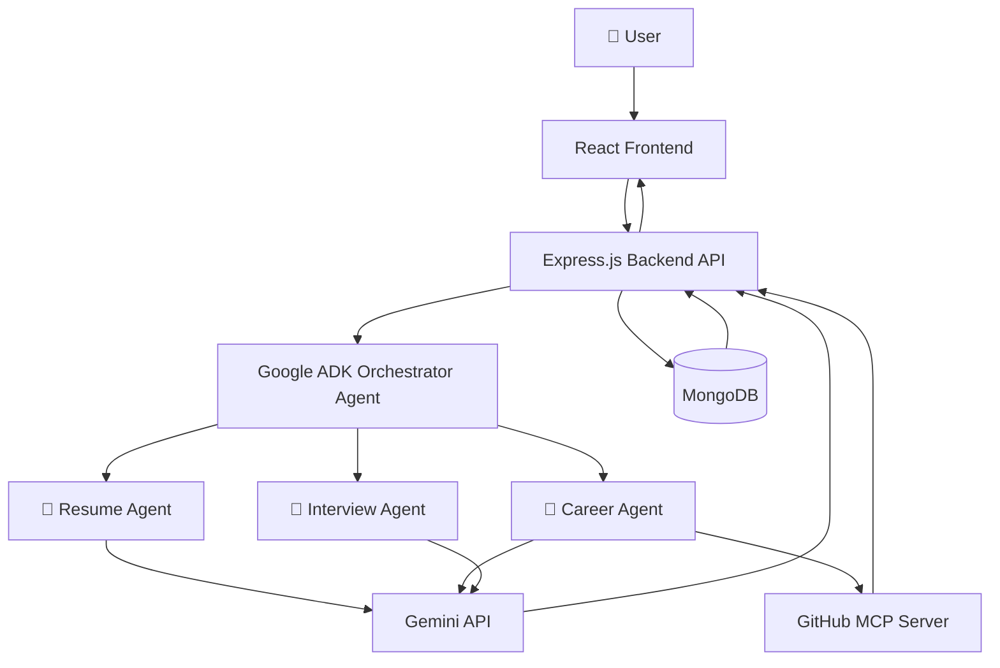

## 🏗️ System Architecture

## Architecture Overview

The system follows a multi-agent architecture built using Google ADK.

- The React frontend provides an intuitive chat interface.
- Express.js acts as the backend API server.
- The Google ADK Orchestrator Agent analyzes every user request and routes it to the appropriate specialist.
- Resume Agent performs resume reviews and ATS optimization.
- Career Agent generates personalized career roadmaps, GitHub analysis, and skill-gap recommendations.
- Interview Agent conducts mock interviews and interview preparation.
- GitHub MCP Server enables external GitHub repository analysis.
- MongoDB stores user accounts, conversations, and analytics.
- Gemini API powers reasoning and natural language generation across all agents.