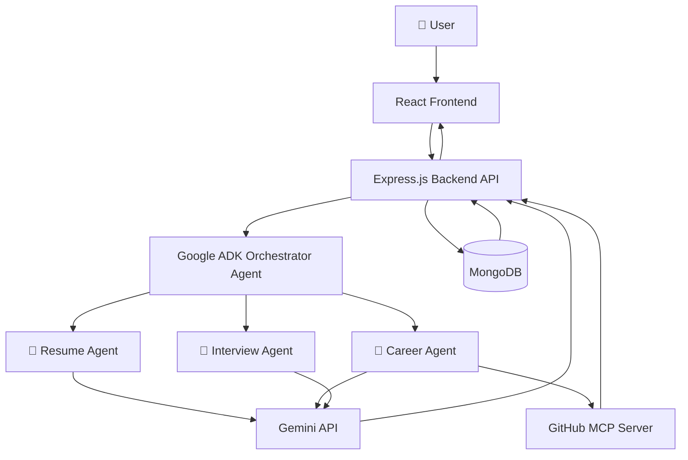

## 🏗️ System Architecture


## Architecture Overview

The system follows a multi-agent architecture built using Google ADK.

- The React frontend provides an intuitive chat interface.
- Express.js acts as the backend API server.
- The Google ADK Orchestrator Agent analyzes every user request and routes it to the appropriate specialist.
- Resume Agent performs resume reviews and ATS optimization.
- Career Agent generates personalized career roadmaps, GitHub analysis, and skill-gap recommendations.
- Interview Agent conducts mock interviews and interview preparation.
- GitHub MCP Server enables external GitHub repository analysis.
- MongoDB stores user accounts, conversations, and analytics.
- Gemini API powers reasoning and natural language generation across all agents.

# 🚀 AI Career Mentor – Multi-Agent Career Guidance System

> An intelligent, AI-powered career assistant built using Google's Agent Development Kit (ADK), Gemini API, React, Express.js, MongoDB, and Firebase Authentication.

The AI Career Mentor is a modern multi-agent system designed to help students, job seekers, and professionals improve every stage of their career journey. Instead of relying on a single AI assistant, the platform delegates specialized tasks to dedicated AI agents, allowing each agent to focus on a specific domain such as resume analysis, interview preparation, or personalized career planning.

---

## 📑 Table of Contents

- Overview
- Features
- Why Multi-Agent Architecture?
- System Architecture
- Tech Stack
- Project Structure
- AI Agents
- Workflow
- Installation
- Environment Variables
- Running the Project
- Screenshots
- Future Improvements
- Contributing
- License

---

# 📖 Overview

Preparing for interviews, optimizing resumes, identifying skill gaps, and planning a career usually requires using multiple websites and tools.

AI Career Mentor brings all of these capabilities into one intelligent platform.

The application uses Google ADK to orchestrate multiple specialized AI agents that collaborate together to solve complex user requests.

Instead of generating generic responses, each agent has a dedicated responsibility, making the overall system significantly more modular, scalable, and accurate.

The platform currently provides:

- Resume Analysis
- ATS Optimization
- Mock Interview Coaching
- Personalized Career Roadmaps
- GitHub Profile Analysis
- Skill Gap Identification
- Learning Recommendations

---

# ✨ Features

## 📄 Resume Expert

Analyze resumes for:

- ATS Compatibility
- Formatting
- Grammar
- Missing Keywords
- Professional Summary
- Action Verbs
- Resume Score
- Suggestions for Improvement

---

## 🎤 AI Interview Coach

Conducts personalized mock interviews.

Supports:

- Technical Interviews
- Behavioral Interviews
- HR Interviews
- Follow-up Questions
- STAR Method Evaluation
- Constructive Feedback

---

## 💼 Career Mentor

Provides personalized career guidance based on:

- Skills
- Interests
- Resume
- GitHub Profile
- Career Goals

Generates:

- Learning Roadmaps
- Skill Gap Analysis
- Project Recommendations
- Career Suggestions

---

## 💻 GitHub Profile Analysis

Analyzes:

- Repository Quality
- README
- Project Structure
- Technologies Used
- Contribution History

Provides improvement suggestions for recruiters.

---

## 🔐 Secure Authentication

Powered by Firebase Authentication.

Supports:

- User Registration
- Login
- Session Management
- Protected Routes

---

## 💬 Conversation History

Users can revisit previous conversations and continue where they left off.

---

# 🤖 Why Multi-Agent Architecture?

Traditional AI applications rely on one large prompt that attempts to solve every problem.

This project instead follows Google's Agent Development Kit (ADK) philosophy by assigning dedicated responsibilities to specialized agents.

Benefits include:

- Better reasoning
- Modular architecture
- Easier maintenance
- Higher scalability
- Reusable agents
- Clear separation of concerns

---

# 🏗️ System Architecture

```
                User
                  │
                  ▼
        React Frontend
                  │
                  ▼
      Express Backend API
                  │
                  ▼
      ADK Orchestrator Agent
       ┌────────┼────────┐
       ▼        ▼        ▼
 Resume   Interview   Career
  Agent      Agent      Agent
       \        |        /
        \       |       /
          Gemini API
              │
     MongoDB + Firebase
              │
         GitHub MCP
```

---

# 🧠 AI Agents

## 🎯 Orchestrator Agent

The central routing agent.

Responsibilities:

- Understand user intent
- Select appropriate specialist
- Coordinate multiple agents
- Aggregate responses

---

## 📄 Resume Agent

Responsible for:

- Resume Reviews
- ATS Analysis
- Resume Scoring
- Resume Improvement Suggestions

---

## 🎤 Interview Agent

Responsible for:

- Technical Interviews
- Behavioral Interviews
- Coding Questions
- Feedback Generation

---

## 💼 Career Agent

Responsible for:

- Career Planning
- Learning Roadmaps
- Skill Recommendations
- GitHub Analysis

---

# ⚙️ Tech Stack

## Frontend

- React
- React Router
- CSS

## Backend

- Node.js
- Express.js

## AI

- Google ADK
- Gemini API

## Database

- MongoDB

## Authentication

- Firebase Authentication

## External Services

- GitHub MCP

---

# 📂 Project Structure

```
AI-Career-Mentor
│
├── frontend/
│   ├── src/
│   ├── components/
│   ├── pages/
│   └── assets/
│
├── backend/
│   ├── agents/
│   │     ├── resumeAgent.js
│   │     ├── interviewAgent.js
│   │     ├── careerAgent.js
│   │     └── orchestrator.js
│   │
│   ├── routes/
│   ├── middleware/
│   ├── server.js
│   └── config/
│
├── README.md
└── package.json
```

---

# 🔄 Request Flow

1. User submits a request.
2. React sends the request to Express API.
3. Express forwards it to the ADK Orchestrator.
4. The Orchestrator identifies the required specialist.
5. Appropriate AI agent processes the request.
6. Gemini API generates intelligent responses.
7. Data is stored in MongoDB.
8. Response is returned to the frontend.

---

# 🚀 Installation

Clone the repository

```bash
git clone https://github.com/Avinash7981/AI-Career-Mentor-Multi-Agent-Career-Guidance-System.git
```

Move into the project

```bash
cd AI-Career-Mentor-Multi-Agent-Career-Guidance-System
```

Install dependencies

Backend

```bash
cd backend
npm install
```

Frontend

```bash
cd frontend
npm install
```

---

# 🔑 Environment Variables

Backend `.env`

```
GEMINI_API_KEY=YOUR_API_KEY

MONGO_URI=YOUR_MONGODB_URI

FIREBASE_PROJECT_ID=YOUR_PROJECT_ID

FIREBASE_PRIVATE_KEY=YOUR_PRIVATE_KEY

FIREBASE_CLIENT_EMAIL=YOUR_CLIENT_EMAIL
```

---

# ▶️ Running the Project

Backend

```bash
npm run dev
```

Frontend

```bash
npm run dev
```

Open:

```
http://localhost:5173
```

---

# 📸 Screenshots

Add screenshots of:

- Dashboard
- Resume Review
- Interview Coach
- Career Roadmap
- GitHub Analysis

---

# 🔮 Future Improvements

- Voice-based interviews
- PDF Resume Export
- AI Cover Letter Generator
- Job Recommendation Engine
- LinkedIn Profile Analysis
- Real-time Interview Scoring
- Company-specific Interview Preparation
- Multi-language Support

---

# 🤝 Contributing

Contributions are welcome.

1. Fork the repository
2. Create a new feature branch
3. Commit your changes
4. Push to your branch
5. Open a Pull Request

---

# 📄 License

This project is licensed under the MIT License.

---

# 👨‍💻 Author

**Avinash Goud**

B.Tech CSE Student | AI Builder | Full Stack Developer

GitHub:
https://github.com/Avinash7981

---

⭐ If you found this project useful, consider giving it a star.
